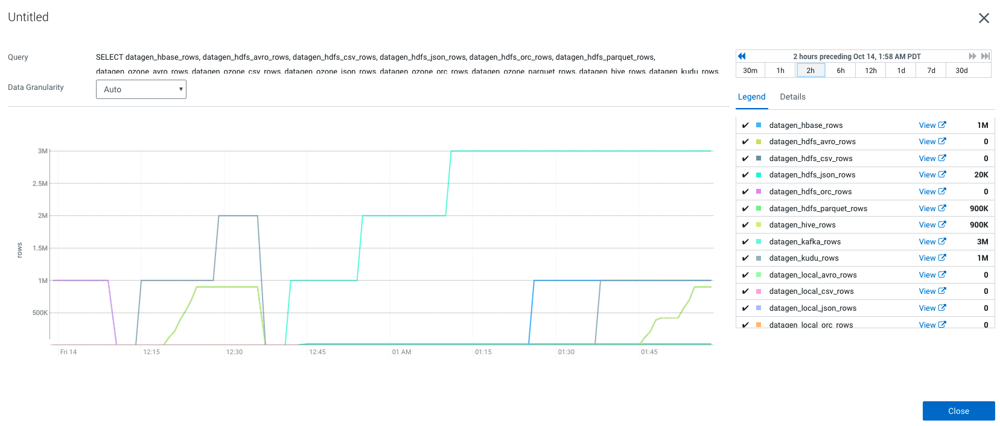

# Metrics

Metrics are automatically created and kept in-memory by Datagen web-server. 

## API

As mentionned in previous section, an API: _/metrics/all_ allows you to get all current metrics about data generation:

- The total number of rows generated
- the total number of generation made

Foreach service:
- The number of rows generated
- The number of files generated (only for Ozone, HDFS & local)

This API call renders a raw JSON file with all metrics in base path and with values as numeric (no null, default is 0).

## Cloudera Manager

Cloudera Agent is gathering for us emtrics automatically from this API and feeds them into Cloudera Manager database.

Hence, in Cloudera Manager, go to Charts > Chart Builder and you can try following query:

```sql
SELECT datagen_hbase_rows, datagen_hdfs_avro_rows, datagen_hdfs_csv_rows, datagen_hdfs_json_rows, datagen_hdfs_orc_rows, datagen_hdfs_parquet_rows, datagen_ozone_avro_rows, datagen_ozone_csv_rows, datagen_ozone_json_rows, datagen_ozone_orc_rows, datagen_ozone_parquet_rows, datagen_hive_rows, datagen_kudu_rows, datagen_kafka_rows, datagen_solr_rows, datagen_local_avro_rows, datagen_local_csv_rows, datagen_local_json_rows, datagen_local_orc_rows, datagen_local_parquet_rows
```

Output will be this chart (for us):



