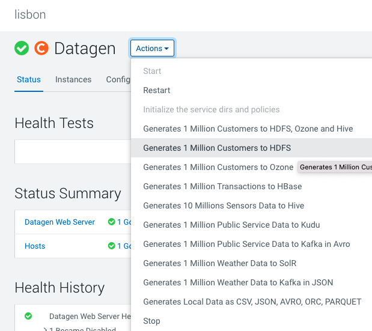
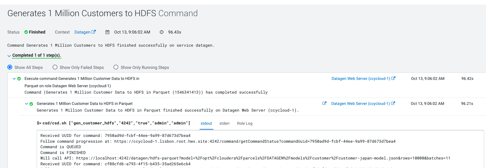
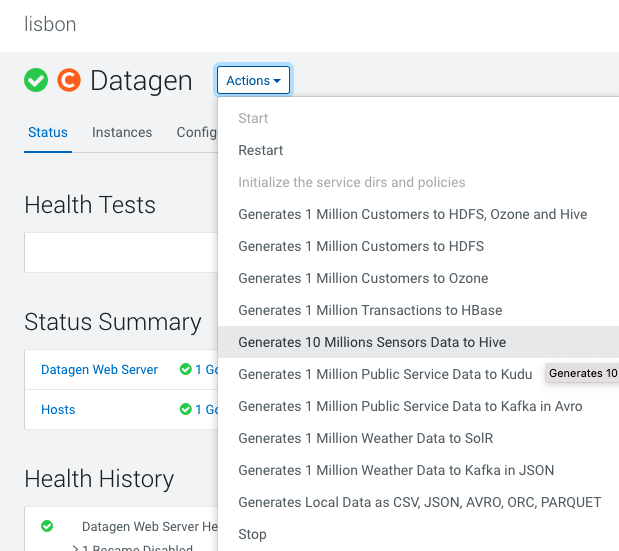
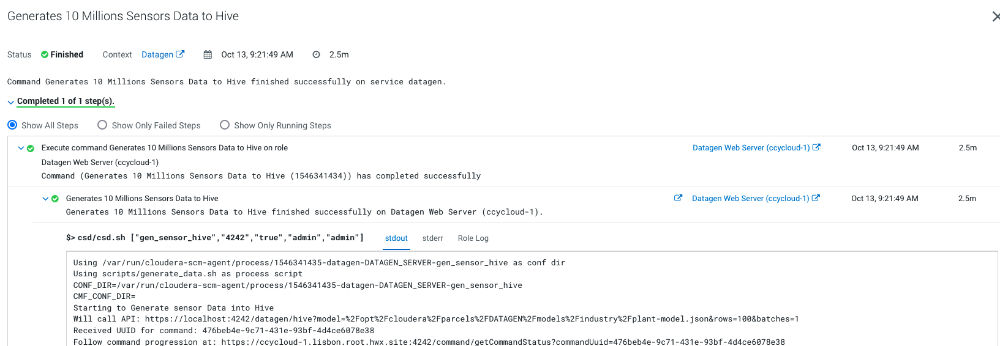
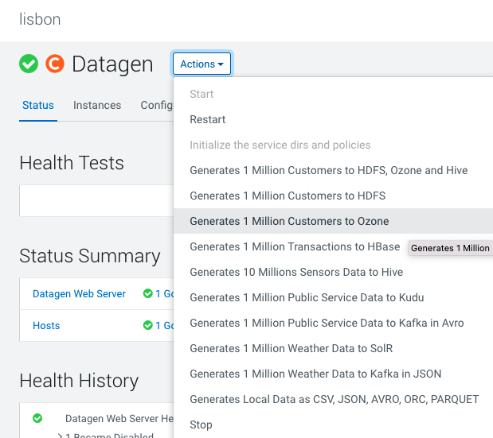
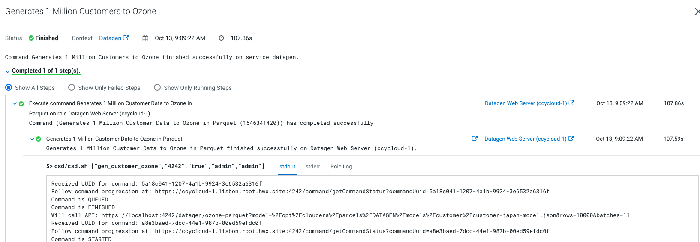
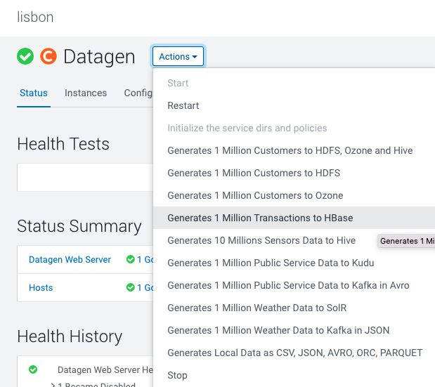
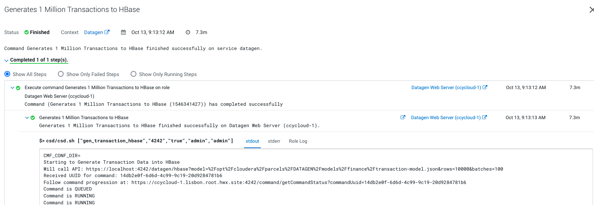

# Data Generation - Basic

Let's do it ! 


### HDFS

In Cloudera Manager: 

**Datagen > Actions > Generates 1 Million Customers to HDFS**



It launches a Cloudera Manager command making different API calls to Datagen Web server to generate data representing customers from different countries.

Output should be:



Let's verify:

In a shell with a logged in user (optionally use datagen ones):

```shell
hdfs dfs -ls /user/datagen/hdfs/customer/
Found 90 items
-rw-r--r--   3 datagen datagen     256024 2022-10-13 09:06 /user/datagen/hdfs/customer/customer-cn-0000000000.parquet
-rw-r--r--   3 datagen datagen     255393 2022-10-13 09:06 /user/datagen/hdfs/customer/customer-cn-0000000001.parquet
-rw-r--r--   3 datagen datagen     255618 2022-10-13 09:06 /user/datagen/hdfs/customer/customer-cn-0000000002.parquet
```


### Hive

In Cloudera Manager: 

**Datagen > Actions > Generates 10 Million Sensors Data to Hive**



It launches a Cloudera Manager command making different API calls to Datagen Web server to generate data representing sensors data.

Output should be:



Let's verify:

In a shell with a logged in user (optionally use datagen ones):

```shell
0: jdbc:hive2://ccycloud-2.lisbon.root.hwx.si> show databases;
...
INFO  : OK
+---------------------+
|    database_name    |
+---------------------+
| datagen_industry    |
| default             |
| information_schema  |
| sys                 |
+---------------------+
0: jdbc:hive2://ccycloud-2.lisbon.root.hwx.si> use datagen_industry;
...
0: jdbc:hive2://ccycloud-2.lisbon.root.hwx.si> show tables;
...
INFO  : OK
+------------------+
|     tab_name     |
+------------------+
| plant            |
| plant_tmp        |
| sensor           |
| sensor_data      |
| sensor_data_tmp  |
| sensor_tmp       |
+------------------+
6 rows selected (0.059 seconds)
0: jdbc:hive2://ccycloud-2.lisbon.root.hwx.si> select * from plant limit 2;
...
INFO  : OK
+-----------------+--------------------+------------+-------------+----------------+
| plant.plant_id  |     plant.city     | plant.lat  | plant.long  | plant.country  |
+-----------------+--------------------+------------+-------------+----------------+
| 1               | Chotebor           | 49,7208    | 15,6702     | Czechia        |
| 2               | Tecpan de Galeana  | 17,25      | -100,6833   | Mexico         |
+-----------------+--------------------+------------+-------------+----------------+
2 rows selected (0.361 seconds)
0: jdbc:hive2://ccycloud-2.lisbon.root.hwx.si> select * from sensor limit 2;
...
INFO  : OK
+-------------------+---------------------+------------------+
| sensor.sensor_id  | sensor.sensor_type  | sensor.plant_id  |
+-------------------+---------------------+------------------+
| 70001             | motion              | 186              |
| 70002             | temperature         | 535              |
+-------------------+---------------------+------------------+
2 rows selected (0.173 seconds)
0: jdbc:hive2://ccycloud-2.lisbon.root.hwx.si> select * from sensor_data limit 2;
...
INFO  : OK
+------------------------+--------------------------------------+----------------------+
| sensor_data.sensor_id  | sensor_data.timestamp_of_production  |  sensor_data.value   |
+------------------------+--------------------------------------+----------------------+
| 88411                  | 1665678228258                        | 1895793134684555135  |
| 52084                  | 1665678228259                        | -621460457255314082  |
+------------------------+--------------------------------------+----------------------+
2 rows selected (0.189 seconds)
```


### Ozone

In Cloudera Manager: 

**Datagen > Actions > Generates 1 Million Customers to Ozone**



It launches a Cloudera Manager command making different API calls to Datagen Web server to generate data representing customers from different countries.

Output should be:



Let's verify:

In a shell with a logged in user (optionally use datagen ones):

```shell
ozone sh key list datagen/customer
{
  "volumeName" : "datagen",
  "bucketName" : "customer",
  "name" : "customer-cn-0000000000.parquet",
  "dataSize" : 255631,
  "creationTime" : "2022-10-13T16:10:02.286Z",
  "modificationTime" : "2022-10-13T16:10:07.866Z",
  "replicationType" : "RATIS",
  "replicationFactor" : 3
}
{
  "volumeName" : "datagen",
  "bucketName" : "customer",
  "name" : "customer-cn-0000000001.parquet",
  "dataSize" : 255633,
  "creationTime" : "2022-10-13T16:10:08.187Z",
  "modificationTime" : "2022-10-13T16:10:08.314Z",
  "replicationType" : "RATIS",
  "replicationFactor" : 3
}
```

### HBase

In Cloudera Manager: 

**Datagen > Actions > Generates 1 Million Transaction to HBase**



It launches a Cloudera Manager command making different API calls to Datagen Web server to generate data representing transactions.

Output should be:



Let's verify:

In a shell with a logged in user (optionally use datagen ones):

```shell
hbase:001:0> list
TABLE
datagenfinance:transaction
1 row(s)
Took 0.9031 seconds
=> ["datagenfinance:transaction"]
hbase:002:0> count 'datagenfinance:transaction'
Current count: 1000, row: 10223641061665677647491
Current count: 2000, row: 10450220651665677774524
Current count: 3000, row: 10680209721665677628857
Current count: 4000, row: 10909219011665677828439
Current count: 5000, row: 1114021121665677841475
Current count: 6000, row: 11370585341665677806053
```


### TROUBLESHOOT

In case of any error, please check the logs through Cloudera Manager or directly on the machine, they are located at _/var/log/datagen/_ .