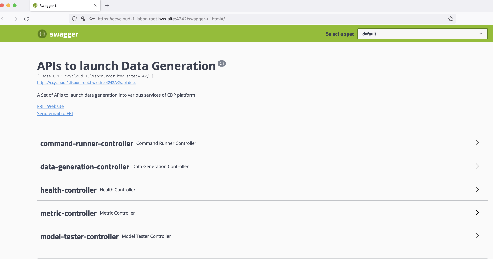

# Data Generation - 2nd part

Using Cloudera Manager and pre-defined actions, data can be generated into all kind of services running in your platform.

Data has been generated in HDFS, Hive, Ozone, HBase.

Before going further and generate data into other services, it worths to take a closer look at what kind of data has been generated.


## Introduction to Models

Heart of Datagen is the **Model**.

Each time that you want to generate data, Datagen will require a Model (or default to the default model).

A Model is a JSON file that defines what your data should look like.

As of now, you only used pre-defined models, but entire goal of Datagen is to let you provide your own model.

We will continue a little bit with pre-defined models, but we will get you through the process of creating model and all entire possibilities offered by the tool in [the next section about models](3-Model.md).


### Pre-defined Models

As you may have guessed data generated in previous services is following some pre-defined models.

You can find these models on all machines where Datagen parcel has been deployed under directory: _/opt/cloudera/parcels/DATAGEN/models/_ . 

Here is the list of all model files you can find in the parcel or in the source code under: _src/main/resources/models/_ .

```shell
ll -R /opt/cloudera/parcels/DATAGEN/models/
/opt/cloudera/parcels/DATAGEN/models/:
total 28
drwxr-xr-x 2 root root 4096 Oct 12 02:57 customer
-rw-r--r-- 1 root root 2111 Oct 12 02:57 example-model.json
drwxr-xr-x 2 root root 4096 Oct 13 00:47 finance
-rw-r--r-- 1 root root 5926 Oct 12 02:57 full-model.json
drwxr-xr-x 2 root root 4096 Oct 13 00:47 industry
drwxr-xr-x 2 root root 4096 Oct 13 00:47 public_service

/opt/cloudera/parcels/DATAGEN/models/customer:
total 36
-rw-r--r-- 1 root root 2144 Oct 12 02:57 customer-china-model.json
-rw-r--r-- 1 root root 2154 Oct 12 02:57 customer-france-model.json
-rw-r--r-- 1 root root 2155 Oct 12 02:57 customer-germany-model.json
-rw-r--r-- 1 root root 2150 Oct 12 02:57 customer-india-model.json
-rw-r--r-- 1 root root 2150 Oct 12 02:57 customer-italy-model.json
-rw-r--r-- 1 root root 2152 Oct 12 02:57 customer-japan-model.json
-rw-r--r-- 1 root root 2150 Oct 12 02:57 customer-spain-model.json
-rw-r--r-- 1 root root 2153 Oct 12 02:57 customer-turkey-model.json
-rw-r--r-- 1 root root 2147 Oct 12 02:57 customer-usa-model.json

/opt/cloudera/parcels/DATAGEN/models/finance:
total 4
-rw-r--r-- 1 root root 1748 Oct 12 02:57 transaction-model.json

/opt/cloudera/parcels/DATAGEN/models/industry:
total 12
-rw-r--r-- 1 root root 1712 Oct 12 02:57 plant-model.json
-rw-r--r-- 1 root root 1476 Oct 12 02:57 sensor-data-model.json
-rw-r--r-- 1 root root 1549 Oct 12 02:57 sensor-model.json

/opt/cloudera/parcels/DATAGEN/models/public_service:
total 16
-rw-r--r-- 1 root root 1899 Oct 12 02:57 incident-model.json
-rw-r--r-- 1 root root 2445 Oct 12 02:57 intervention-team-model.json
-rw-r--r-- 1 root root 3445 Oct 12 02:57 weather-model.json
-rw-r--r-- 1 root root 2289 Oct 12 02:57 weather-sensor-model.json

```

#### HDFS & Ozone

HDFS & Ozone buttons created 1 million customers from different countries (using the different customer models under _/opt/cloudera/parcels/DATAGEN/models/customer/_) and pushed them in Parquet file.

Sample of data in JSON format:

```json
{ "name" : "Loris", "id" : "790001", "birthdate" : "1987-01-11", "city" : "Stevensville", "country" : "USA", "email" : "Loris@company.us", "phone_number" : "+1 7225688066", "membership" : "SILVER" }
{ "name" : "Marcell", "id" : "490001", "birthdate" : "1950-06-22", "city" : "Pontecorvo", "country" : "Italy", "email" : "Marcell@company.it", "phone_number" : "+39 995887416", "membership" : "BRONZE" }
{ "name" : "Ryong", "id" : "520001", "birthdate" : "1941-02-05", "city" : "Yachiyo", "country" : "Japan", "email" : "Ryong@company.jp", "phone_number" : "+81 809127101", "membership" : "PLATINUM" }
```

#### HBase

HBase button created a 1 million transactions (using the transaction model under _/opt/cloudera/parcels/DATAGEN/models/finance/transaction-model.json_).

Sample of data in JSON format:

```json
{ "sender_id" : "50902", "receiver_id" : "10391", "amount" : "0.8084345", "execution_date" : "1665728236778", "currency" : "EUR" }
{ "sender_id" : "21403", "receiver_id" : "68104", "amount" : "0.65117764", "execution_date" : "1665728285129", "currency" : "USD" }
```


#### Hive

Hive button created a 1 million sensors data (using different models under _/opt/cloudera/parcels/DATAGEN/models/industry/_).

It will generate 100 plants data like this:

```json
{ "plant_id" : "1", "city" : "Bollene", "lat" : "44,2803", "long" : "4,7489", "country" : "France" }
```

It will generate 100 000 sensors like this (each can be linked to a plant):

```json
{ "sensor_id" : "1", "sensor_type" : "humidity", "plant_id" : "690" }
```

It will generate 1 000 000 sensors data like this (each can be linked to a sensor):

```json
{ "sensor_id" : "58764", "timestamp_of_production" : "1665728724586", "value" : "-3000244563995128335" }
```


### Local files 

In Cloudera Manager: 

**Datagen > Actions > Generate Local data as CSV, JSON, AVRO, ORC, PARQUET**


It launches a Cloudera Manager command making different API calls to Datagen Web server to generate multiple data using almost all possible models.

Output should be:


Let's Verify
{: .label .label-green }

In a shell with a logged in user (optionally use datagen ones):

```shell
 cat /home/datagen/customer/customer-fr-0000000000.json
{ "name" : "Josse", "id" : "120001", "birthdate" : "2001-08-03", "city" : "Meylan", "country" : "France", "email" : "Josse@company.fr", "phone_number" : "+33 444585074", "membership" : "BRONZE" }
{ "name" : "Piet", "id" : "120002", "birthdate" : "1970-06-17", "city" : "Bures-sur-Yvette", "country" : "France", "email" : "Piet@company.fr", "phone_number" : "+33 851063627", "membership" : "BRONZE" }
{ "name" : "Armand", "id" : "120003", "birthdate" : "1990-10-04", "city" : "Notre-Dame-de-Gravenchon", "country" : "France", "email" : "Armand@company.fr", "phone_number" : "+33 575158362", "membership" : "BRONZE" }
{ "name" : "Marvin", "id" : "120004", "birthdate" : "1960-10-04", "city" : "Saint-Pryve-Saint-Mesmin", "country" : "France", "email" : "Marvin@company.fr", "phone_number" : "+33 588241506", "membership" : "BRONZE" }
{ "name" : "Vivian", "id" : "120005", "birthdate" : "1994-04-28", "city" : "La Cadiere-d'Azur", "country" : "France", "email" : "Vivian@company.fr", "phone_number" : "+33 553370858", "membership" : "BRONZE" }
{ "name" : "Jakob", "id" : "120006", "birthdate" : "1976-08-02", "city" : "Chaville", "country" : "France", "email" : "Jakob@company.fr", "phone_number" : "+33 208782811", "membership" : "BRONZE" }
{ "name" : "Bo", "id" : "120007", "birthdate" : "1966-10-14", "city" : "Brignoles", "country" : "France", "email" : "Bo@company.fr", "phone_number" : "+33 068739422", "membership" : "PLATINUM" }
{ "name" : "Emilienne", "id" : "120008", "birthdate" : "1976-02-23", "city" : "Orange", "country" : "France", "email" : "Emilienne@company.fr", "phone_number" : "+33 303877991", "membership" : "BRONZE" }
{ "name" : "Elise", "id" : "120009", "birthdate" : "1965-11-28", "city" : "Cosne sur Loire", "country" : "France", "email" : "Elise@company.fr", "phone_number" : "+33 540812701", "membership" : "SILVER" }
{ "name" : "Roelof", "id" : "120010", "birthdate" : "1982-06-01", "city" : "Magny-en-Vexin", "country" : "France", "email" : "Roelof@company.fr", "phone_number" : "+33 252194443", "membership" : "BRONZE" }

cat /home/datagen/finance/transaction/transaction-0000000000.csv

sender_id,receiver_id,amount,execution_date,currency
"11292","27627","0.7721951","1665729006111","USD"
"49294","95851","0.4893235","1665729006111","EUR"
"68670","8844","0.009439588","1665729006111","USD"
"61487","46071","0.22023022","1665729006111","EUR"
"14383","57358","0.07566887","1665729006111","YEN"
"89570","96238","0.35353237","1665729006111","USD"
"66066","69065","0.87496656","1665729006111","USD"
"43894","87454","0.11435127","1665729006111","USD"
"76777","19367","0.06878656","1665729006111","EUR"
"53649","14975","0.9570634","1665729006111","EUR"

ls -R /home/datagen/industry/
/home/datagen/industry/:
plant  sensor  sensor_data

/home/datagen/industry/plant:
plant-0000000000.avro

/home/datagen/industry/sensor:
sensor-0000000000.parquet

/home/datagen/industry/sensor_data:
sensor_data-0000000000.orc
```

### SolR

In Cloudera Manager: 

**Datagen > Actions > Generate 1 Million Weather Data to SolR**


It launches a Cloudera Manager command making different API calls to Datagen Web server to generate multiple data using almost all possible models.

Output should be:


It will generate 1 million weather data like this (using the weather model under _/opt/cloudera/parcels/DATAGEN/models/public_service/weather-model.json_)


```json
{ "city" : "Seysses", "date" : "2021-03-25", "lat" : "43,4981", "long" : "1,3125", "wind_provenance_9_am" : "NORTH", "wind_force_9_am" : "3", "wind_provenance_9_pm" : "WEST", "wind_force_9_pm" : "12", "pressure_9_am" : "1004", "pressure_9_pm" : "1008", "humidity_9_am" : "46", "humidity_9_pm" : "52", "temperature_9_am" : "22", "temperature_9_pm" : "-8", "rain" : "false" }
```


Let's Verify
{: .label .label-green }


Access SolR UI, (login as a user with enough rights):


### Kudu


In Cloudera Manager: 

**Datagen > Actions > Generate 1 Million Public Service Data to Kudu**


It launches a Cloudera Manager command making different API calls to Datagen Web server to generate multiple data using almost all possible models.

Output should be:


It will generate 1 million weather data like this (using the weather model under _/opt/cloudera/parcels/DATAGEN/models/public_service/incident-model.json_ )


```json
{ "city" : "Le Rove", "lat" : "43,3692", "long" : "5,2503", "reporting_timestamp" : "1665732947892", "emergency" : "URGENT", "type" : "WATER" }
```

Let's Verify
{: .label .label-green }

Go to Hue or an Impala shell and make an INVALIDATE METADATA command to refresh the cache, then you will be able to see in database: _datagen_ a new table _publicservice_incident_ :


### Kafka

**Datagen > Actions > Generate 1 million weather data to Kafka in JSON OR Public Service Data to Kafka in Avro**


It launches a Cloudera Manager command making different API calls to Datagen Web server to generate multiple data using almost all possible models.

Output should be:


It will generate 1 million weather data like this (using the weather model under _/opt/cloudera/parcels/DATAGEN/models/public_service/weather-model.json_)


```json
{ "city" : "Seysses", "date" : "2021-03-25", "lat" : "43,4981", "long" : "1,3125", "wind_provenance_9_am" : "NORTH", "wind_force_9_am" : "3", "wind_provenance_9_pm" : "WEST", "wind_force_9_pm" : "12", "pressure_9_am" : "1004", "pressure_9_pm" : "1008", "humidity_9_am" : "46", "humidity_9_pm" : "52", "temperature_9_am" : "22", "temperature_9_pm" : "-8", "rain" : "false" }
```

Let's Verify
{: .label .label-green }

You can make a kafka-console-consumer with enough rights and consume the topic from the beginning to verify production of messages.

But we will instead login to Streams Messaging Manager with a user's with enough rights and see data:


If you picked th data generation with AVRO format, in Streams Messaging Manager:


If you picked th data generation with AVRO format, you can go to Schema Registry URL (login with a user's with enough rights) and see the newly added schema:


Finally, if you have SQL Stream Builder installed in your cluster, make sure that user's ssb & flink have access rights to generated topic, logged to the web console, upload your keytab if necessary and create the table on kafka topic (in JSON):


Then do a sample query to visualize data:


## APIs 
 
More than just these pre-defined buttons, Datagen is completely configurable and customizable.

All previous generation were indeed just a bunch opf API calls to Datagen web server.

A user should take advantage of APIs provided by Datagen to run data generation.

Now, we will go through a simple example, but if you want more information on APIs provided, see [section on APIs](../advanced/1-apis.md).

First, go to Cloudera Manager > Datagen and click on _Datagen Swagger UI_ :

It will open a new tab to the Swagger of the Datagen Web Server, this swagger will ask to authenticate you with the user/password you passed during the installation. 
If you did not provide one, it is by default **admin** as user and **admin** as password.
(You can change this whenever you want in the configuration of Datagen).

Swagger should looks like this:



If you open the data-generation-controller, you should have a lot of endpoints: one per type of service where you want to generate data.

We will use an example the _/datagen/hdfs-json_ endpoint.


Click on it.


### Rows, Batches, Threads, Models

If you click on _Try it out_ , you will bea able to fill in all possible parameters.

Do not be scared ! **ALL PARAMETERS ARE OPTIONAL and have default values if you do not provide some**

All APIs calls for data generation have at least 5 parameters in common:

* **rows** = Number of rows to generate at each batch of data generation
* **batches** = Number of batches to launch (you will end up to have (rows x batches) total rows generated)
* **threads** = To speed up generation, you can multi thread this (by default it is single-threaded), it is recommended to go on 10 threads.
* model by specifiying either:
    * **model_file** = file path on the machine where a model is present (for example /opt/cloudera/parcels/DATAGEN/models/public_service/weather-model.json)
    * **model** = upload directly to the swagger your model file from your computer

There are 3 parameters related to kerberos authentication:

* **kerb_auth** = true or false depending on using kerberos or not
* **kerb_user** = kerberos user to log in with to make data generation
* **kerb_keytab** = path to the keytab of this user to login with (must be datagen user's readable)

By default, all these are set to the datagen's user.

There are also 2 other parameters that enables you to schedule a launch:

* **scheduled** = true or false
* **delay_between_executions_seconds** = The interval (in seconds) between two executions


All These parameters are discussed further in [section on APIs](../advanced/1-apis.md).


### Specific configs for HDFS

Each endpoint for a sink has other parameters that allows you to fully override the actual configuration for this service and this will only be in use for this data generation.

In the case of HDFS here, we have:

* core_site_path = path to the core-site.xml
* hdfs_site_path = path to the hdfs-site.xml
* hdfs_uri = hdfs://mynamservice/


### Example launch

In this example, we will generate data into HDFS in JSON format, using the swagger and specifiyig some parameters.

In the swagger UI, open hdfs-json endpoint and click on try it out, then do this:

- Set batches to 10
- Set rows to 1000
- Set threads to 10
- Set model to /opt/cloudera/parcels/DATAGEN/models/public_service/weather-model.json

You can click on _Execute_ .

Swagger will show you just below what is the equivalent curl request:

```shell
curl -X POST "https://ccycloud-1.lisbon.root.hwx.site:4242/datagen/hdfs-json" -H  "accept: */*" -H  "Content-Type: multipart/form-data" -F "batches=10" -F "model=/opt/cloudera/parcels/DATAGEN/models/public_service/weather-model.json" -F "rows=1000" -F "threads=10"
```

It will also directly answer you and tell you if there are any errors with your model, answer for us is:


```shell
{ "commandUuid": "61b9757f-78da-4773-9c5d-a3f154f2b524" , "error": "" }
```

A command UUID is returned and should be used to check the status of the data generation launched using another API, located in command-runner-controller, called _/command/getCommandStatus_ . This API required the command UUID received and will return status as a JSON like this: 

```shell
{ "commandUuid": "61b9757f-78da-4773-9c5d-a3f154f2b524" , "status": "FINISHED" , "comment": "" , + "progress": "100.0" ,  "duration": "858ms" }
```

Let's Verify
{: .label .label-green }

In a shell with a logged in user (optionally use datagen ones):

```shell
 hdfs dfs -ls /user/datagen/hdfs/publicservice/weather/
 
Found 10 items
-rw-r--r--   3 datagen datagen     756988 2022-10-14 00:44 /user/datagen/hdfs/publicservice/weather/weather-0000000000.json
-rw-r--r--   3 datagen datagen     756448 2022-10-14 00:44 /user/datagen/hdfs/publicservice/weather/weather-0000000001.json
-rw-r--r--   3 datagen datagen     756374 2022-10-14 00:44 /user/datagen/hdfs/publicservice/weather/weather-0000000002.json
-rw-r--r--   3 datagen datagen     756204 2022-10-14 00:44 /user/datagen/hdfs/publicservice/weather/weather-0000000003.json
-rw-r--r--   3 datagen datagen     756878 2022-10-14 00:44 /user/datagen/hdfs/publicservice/weather/weather-0000000004.json
-rw-r--r--   3 datagen datagen     756132 2022-10-14 00:44 /user/datagen/hdfs/publicservice/weather/weather-0000000005.json
-rw-r--r--   3 datagen datagen     756812 2022-10-14 00:44 /user/datagen/hdfs/publicservice/weather/weather-0000000006.json
-rw-r--r--   3 datagen datagen     757160 2022-10-14 00:44 /user/datagen/hdfs/publicservice/weather/weather-0000000007.json
-rw-r--r--   3 datagen datagen     756216 2022-10-14 00:44 /user/datagen/hdfs/publicservice/weather/weather-0000000008.json
-rw-r--r--   3 datagen datagen     756000 2022-10-14 00:44 /user/datagen/hdfs/publicservice/weather/weather-0000000009.json

 hdfs dfs -cat /user/datagen/hdfs/publicservice/weather/weather-0000000000.json

{ "city" : "Beauchamp", "date" : "2017-03-23", "lat" : "49,0139", "long" : "2,19", "wind_provenance_9_am" : "EAST", "wind_force_9_am" : "98", "wind_provenance_9_pm" : "WEST", "wind_force_9_pm" : "5", "pressure_9_am" : "1003", "pressure_9_pm" : "1009", "humidity_9_am" : "25", "humidity_9_pm" : "35", "temperature_9_am" : "30", "temperature_9_pm" : "9", "rain" : "false" }
{ "city" : "La Garnache", "date" : "2016-02-19", "lat" : "46,8906", "long" : "-1,8311", "wind_provenance_9_am" : "WEST", "wind_force_9_am" : "49", "wind_provenance_9_pm" : "NORTH", "wind_force_9_pm" : "75", "pressure_9_am" : "1014", "pressure_9_pm" : "1002", "humidity_9_am" : "30", "humidity_9_pm" : "8", "temperature_9_am" : "5", "temperature_9_pm" : "33", "rain" : "false" }
{ "city" : "Escoublac", "date" : "2018-04-10", "lat" : "47,2858", "long" : "-2,3922", "wind_provenance_9_am" : "NORTH", "wind_force_9_am" : "62", "wind_provenance_9_pm" : "NORTH", "wind_force_9_pm" : "111", "pressure_9_am" : "1019", "pressure_9_pm" : "1013", "humidity_9_am" : "77", "humidity_9_pm" : "56", "temperature_9_am" : "-1", "temperature_9_pm" : "16", "rain" : "true" }
{ "city" : "Anse", "date" : "2019-06-13", "lat" : "45,9356", "long" : "4,7194", "wind_provenance_9_am" : "WEST", "wind_force_9_am" : "96", "wind_provenance_9_pm" : "EAST", "wind_force_9_pm" : "114", "pressure_9_am" : "1005", "pressure_9_pm" : "1009", "humidity_9_am" : "44", "humidity_9_pm" : "46", "temperature_9_am" : "3", "temperature_9_pm" : "21", "rain" : "false" }
{ "city" : "Dammarie-le-Lys", "date" : "2015-07-24", "lat" : "48,5177", "long" : "2,6402", "wind_provenance_9_am" : "EAST", "wind_force_9_am" : "120", "wind_provenance_9_pm" : "WEST", "wind_force_9_pm" : "87", "pressure_9_am" : "1006", "pressure_9_pm" : "1012", "humidity_9_am" : "68", "humidity_9_pm" : "21", "temperature_9_am" : "-9", "temperature_9_pm" : "-1", "rain" : "false" }
{ "city" : "Saint-Remy-les-Chevreuse", "date" : "2021-10-05", "lat" : "48,7058", "long" : "2,0719", "wind_provenance_9_am" : "SOUTH", "wind_force_9_am" : "62", "wind_provenance_9_pm" : "WEST", "wind_force_9_pm" : "71", "pressure_9_am" : "1017", "pressure_9_pm" : "1007", "humidity_9_am" : "70", "humidity_9_pm" : "95", "temperature_9_am" : "33", "temperature_9_pm" : "-7", "rain" : "true" }
{ "city" : "Vouneuil-sous-Biard", "date" : "2020-07-06", "lat" : "46,5731", "long" : "0,2714", "wind_provenance_9_am" : "EAST", "wind_force_9_am" : "11", "wind_provenance_9_pm" : "EAST", "wind_force_9_pm" : "21", "pressure_9_am" : "1019", "pressure_9_pm" : "1017", "humidity_9_am" : "55", "humidity_9_pm" : "20", "temperature_9_am" : "5", "temperature_9_pm" : "23", "rain" : "false" }
{ "city" : "Tourves", "date" : "2016-05-07", "lat" : "43,4081", "long" : "5,9239", "wind_provenance_9_am" : "NORTH", "wind_force_9_am" : "10", "wind_provenance_9_pm" : "WEST", "wind_force_9_pm" : "39", "pressure_9_am" : "1019", "pressure_9_pm" : "1000", "humidity_9_am" : "60", "humidity_9_pm" : "93", "temperature_9_am" : "0", "temperature_9_pm" : "29", "rain" : "false" }
```


It's over for basic data generation, now you can move on to [create your own custom model](3-Model.md) or if you prefer, you can go and [play with APIs](../advanced/1-apis.md)

