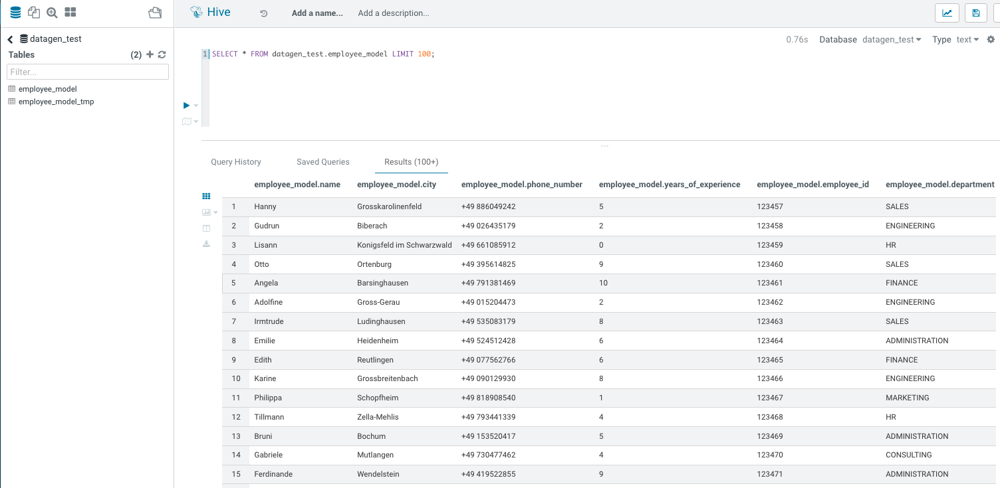

# Model

Model is one simple JSON file, describing what type of data should be generated, where and allows to specify some specific options.


## Structure of a model

A model file is composed of 4 sections (each of this section is an array):

```json
{
  "Fields": [

  ],
  "Table_Names": [

  ],
  "Primary_Keys": [

  ],
  "Options": [

  ]
}
```

* **Field** list all fields (columns) you want to generate with their type etc...
* **Table_Names** is an array of keys/values to define where data should be generated
* **Primary_Keys** is an array of keys/values to define what primary keys will be used for kafka, kudu, hbase
* **Options** is an array of keys/values to define some specific properties (such as replication factor, buffer etc..) 


Let's deep dive into each section below.

## Fields

A field is an object consisting of at least two required parameters:

- ****name**: name of the field 
- ****type**: Type of the field

Then, you will have multiple optional parameters that could depend on its type:

- **min**
- **max**
- **length**
- **possible_values**
- **possible_values_weighted**
- **filters**
- **conditionals**


### Types of Fields - **Basic

Fields can be of many different types, here are the basic ones, self-explicit:

- **STRING**  _an alphaNumeric string (length represents length of string, by default 20 if not set)_
- **STRINGAZ**  _an alpha non-numeric string (length represents length of string, by default 20 if not set)_
- **INTEGER** 
- **INCREMENT_INTEGER** _An integer increment for each row_
- **INCREMENT_LONG** _A long incremented for each row_
- **BOOLEAN** 
- **FLOAT** 
- **LONG** 
- **TIMESTAMP** 
- **BYTES** _length represents length of byte array, by default 20_
- **HASHMD5**   _hash of a random string (length represents size of byte array, by default 32)_
- **BLOB**   _byte array of default 1MB (length represents length of byte array) (Use it carefully)_


Some Examples:


```json
{
    "name": "size",
    "type": "INTEGER"
}
```

```json
{
    "name": "bool",
    "type": "BOOLEAN"
}
```

```json
{
    "name": "startDate",
    "type": "TIMESTAMP"
}
```

Some Examples with min, max, length:

An integer between 18 and 99:
```json
{
    "name": "age",
    "type": "INTEGER",
    "min": 18,
    "max": 99
}
```

A bytes array of 10 bytes:

```json
{
    "name": "bytesLittleArray",
    "type": "BYTES",
    "length" : 10
}
```

Examples with possible_values:

A string picked between values defined in possible_values:
```json
{
    "name": "department",
    "type": "STRING",
    "possible_values": ["hr", "consulting", "marketing", "finance"]
}
```

A string picked between values defined in possible_values_weighted, each has a different weights (and sum of all is 100):
(In that case, there will 70% of _BRONZE_, 20% of _SILVER_, 8% of _GOLD_, 2% of _PLATINUM_)
```json
{
  "name": "membership",
  "type": "STRING",
  "possible_values_weighted": {
    "BRONZE": 70,
    "SILVER": 20,
    "GOLD": 8,
    "PLATINUM": 2
  }
}
```

### Types of Fields - **Advanced

These are more "advanced" types :

- **BIRTHDATE**  _a date between 1910 & 2020 (but you can set your own limits)_
- **NAME**  _a first name taken from a dictionary of over 10,000+ names (can be filtered by country)_
- **COUNTRY**   _a country name taken from a dictionary_
- **PHONE NUMBER** A 10 digits with international indicator in front (can be filtered by country)_
- **EMAIL**   _string as in form of (<name>.<name>|<AZ09><name>)@(gaagle.com|yahaa.com|uutlook.com|email.fr)_
- **IP**   _a string representing an IP in form of Ipv4: 0-255.0-255.0-255.0-255_
- **UUID** _an unique universal identifier: xxxx-xxxx-xxxx-xxxx_
- **CITY**  _an object representing an existing city (name, lat, long, country) made from a dictionary of over 10,000+ cities, only the name is taken for this field (can be filtered by country)_
- **CSV**   _an object taken from a given CSV file_
- **LINK**  _a string whose values is derived from another field, currently from a CITY or CSV field_


Some basic examples:

```json
{
  "name": "name",
  "type": "NAME",
  "filters": ["USA"]
}
```

```json
{
  "name": "birthdate",
  "type": "BIRTHDATE",
  "min": "1/1/1955",
  "max": "1/1/1999"
}
```

### Field City

City is a special field that loads a dictionnary of 40K+ cities over the world with associated latitude, longitude and country.

It can be filtered by one or more country.

This below example creates 4 fields: 

- City name (only in France and Spain)
- Latitude of this city (available as lat)
- Longitude of this city (available as long)
- Country where this city is (available as country)

```json
{
  "name": "city",
  "type": "CITY",
  "filters": ["France", "Spain"]
},
{
  "name": "city_lat",
  "type": "LINK",
  "conditionals": {
    "link": "$city.lat"
  }
},
{
  "name": "city_long",
  "type": "LINK",
  "conditionals": {
    "link": "$city.long"
  }
},
{
  "name": "city_country",
  "type": "LINK",
  "conditionals": {
    "link": "$city.country"
  }
}
```

### Field CSV

It is a special Field that will read a CSV provided by its path, load it into memory, parse it.

It is able to apply filters on this, and you can create other fields derived from this one.

For example, we have this CSV in _/opt/cloudera/parcels/DATAGEN/dictionaries/person_test.csv_ :

```csv
name;department;country
francois;PS;France
kamel;SE;France
thomas;RH;Germany
sebastian;PS;Spain
```

We can create two Fields:

- One will be the name of the person (filtered on the country that should be France)
- The department of this person

```json
{
  "name": "person",
  "type": "CSV",
  "filters": ["country=France"],
  "file": "/opt/cloudera/parcels/DATAGEN/dictionaries/person_test.csv",
  "field": "name"
},
{
  "name": "person_department",
  "type": "LINK",
  "conditionals": {
    "link": "$person.department"
  }
}
```

### Conditionals - **Formula

Conditionals is an object that allows you to define fields that are depending from others.

Formula, is a formula to evaluate where _${field_name}_ are replaced with their values, for example:

```json
{
  "name": "starting_hour",
  "type": "INTEGER",
  "min": 0,
  "max": 16
},
{
  "name": "finished_hour",
  "type": "INTEGER",
  "conditionals": {
    "formula": "$starting_hour** 8"
  }
},
```


### Conditionals - **injection

Conditionals is an object that allows you to define fields that are depending from others.

Injection, is a string where _${field_name}_ are replaced with their values, for example:

```json
{
  "name": "email",
  "type": "STRING",
  "conditionals": {
    "injection": "${name}@company.it"
  }
}
```

### Conditionals - **Conditions Line

Conditionals is an object that allows you to define fields that are depending from others.

Conditions Lines are a bunch of lines evaluated one after the other, if one is true, then value is set to right expression.

Each conditional line is composed of conditions in the form of a field name (reported by a $) which is substituted by its value and operators (<,>,=,!=) that will check against a defined value or a field (which is also substituted). The condition line can be composed of multiple checks using & (AND) or | (OR) operators.

An example:

```json
{
  "name": "rain",
  "type": "STRING",
  "conditionals": {
    "$humidity_9_am>70 & $temperature_9_am<20 & $wind_force_9_am<80" : "true",
    "$humidity_9_pm>70 & $temperature_9_pm<20 & $wind_force_9_am<80" : "true",
    "$wind_provenance_9_am=NORTH & $wind_force_9_am>80" : "true",
    "$wind_provenance_9_pm=NORTH & $wind_force_9_pm>80" : "true",
    "$humidity_9_pm>70 & $temperature_9_pm<25 & $pressure_9_pm<1010": "true",
    "$humidity_9_am>70 & $temperature_9_am<25 & $pressure_9_am<1010": "true",
    "default" : "false"
  }
}
```


## Table_Names

These are all available keys to configure where data should be generated:

- **HDFS_FILE_PATH**
- **HDFS_FILE_NAME**
- **HBASE_TABLE_NAME**
- **HBASE_NAMESPACE**
- **KAFKA_TOPIC**
- **OZONE_VOLUME**
- **OZONE_BUCKET**
- **OZONE_KEY_NAME**
- **OZONE_LOCAL_FILE_PATH**
- **SOLR_COLLECTION**
- **HIVE_DATABASE**
- **HIVE_HDFS_FILE_PATH**
- **HIVE_TABLE_NAME**
- **HIVE_TEMPORARY_TABLE_NAME**
- **KUDU_TABLE_NAME**
- **LOCAL_FILE_PATH**
- **LOCAL_FILE_NAME**
- **AVRO_NAME**


## Primary_Keys

These are all the available keys to configure for some services:

- **KAFKA_MSG_KEY**
- **HBASE_PRIMARY_KEY**
- **KUDU_PRIMARY_KEYS**
- **KUDU_HASH_KEYS**
- **KUDU_RANGE_KEYS

## Options

This are all the available keys to configure basic settings for some services:**

- **HBASE_COLUMN_FAMILIES_MAPPING**
        This mapping must be in the form : "CF:col1,col2;CF2:col5"
- **SOLR_SHARDS**
- **SOLR_REPLICAS**
- **KUDU_REPLICAS**
- **ONE_FILE_PER_ITERATION**
- **KAFKA_MESSAGE_TYPE**
- **KAFKA_JAAS_FILE_PATH**
- **SOLR_JAAS_FILE_PATH**
- **HIVE_THREAD_NUMBER**
- **HIVE_ON_HDFS**
- **HIVE_TEZ_QUEUE_NAME**
- **CSV_HEADER**
- **DELETE_PREVIOUS**
- **PARQUET_PAGE_SIZE**
- **PARQUET_ROW_GROUP_SIZE**
- **PARQUET_DICTIONARY_PAGE_SIZE**
- **PARQUET_DICTIONARY_ENCODING**
- **KAFKA_ACKS_CONFIG**
- **KAFKA_RETRIES_CONFIG**
- **KUDU_BUCKETS**
- **KUDU_BUFFER**
- **KUDU_FLUSH**
- **OZONE_REPLICATION_FACTOR**
- **HDFS_REPLICATION_FACTOR**


## Example on how to create a model ?

Let's create a simple model to generate some data into Hive file:

I would like to generate something that will represent employees:

- **A name
- **Their location city
- **Their birthdate
- **Their phone number
- **Years of experience in the company
- **Their employee ID (in 6 digits)
- **Their department (among HR, CONSULTING, FINANCE, SALES, ENGINEERING, ADMINISTRATION, MARKETING) 

And the company is based in Germany, as all employees by the way.


So here is the final JSON I outcome:

```json
{
    "Fields": [
      {
        "name": "name",
        "type": "NAME",
        "filters": ["Germany"]
      },
      {
        "name": "city",
        "type": "CITY",
        "filters": ["Germany"]
      },
      {
        "name": "phone_number",
        "type": "PHONE",
        "filters": ["Germany"]
      },
      {
        "name": "years_of_experience",
        "type": "INTEGER",
        "min": 0,
        "max": 10
      },
      {
        "name": "employee_id",
        "type": "INCREMENT_INTEGER",
        "min": 123456
      },
      {
        "name": "department",
        "type": "STRING",
        "possible_values": ["HR", "CONSULTING", "FINANCE", "SALES", "ENGINEERING", "ADMINISTRATION", "MARKETING"]
      }
    ],
    "Table_Names": [
        {"HIVE_HDFS_FILE_PATH": "/user/datagen/hive/employee_model/"},
        {"HIVE_DATABASE": "datagen_test"},
        {"HIVE_TABLE_NAME":  "employee_model"},
        {"HIVE_TEMPORARY_TABLE_NAME":  "employee_model_tmp"},
        {"AVRO_NAME":  "datagenemployee"}
    ],
    "Primary_Keys": [
    ],
    "Options": [
    ]
  }
```


## Test a Model

To test a model before launching a data generation, it is possible to use the API to test it.

Under model-tester-controller, an API _/model/test_ takes as input a path to a model or directly upload a model and it returns one row generated with this model.

Output is:

```json
{ "name" : "Gerhilt", "city" : "Beelen", "phone_number" : "+49 299776078", "years_of_experience" : "2", "employee_id" : "123457", "department" : "FINANCE" }
```


## Launch Data Generation

Now, we are ready, using the swagger or making direclty an API call (with curl, postman or anything else), we launch a data generation like this:

Command in the swagger:
```shell
curl -X POST "https://ccycloud-1.lisbon.root.hwx.site:4242/datagen/hive" -H  "accept: */*" -H  "Content-Type: multipart/form-data" -F "batches=10" -F "model_file=@model-test.json;type=application/json" -F "rows=10000" -F "threads=10"
```

Returns following UUID:

```json
{ "commandUuid": "1567dfba-a8f9-4da9-b389-9bc30f4ec1d5" , "error": "" }
```

In Datagen Webserver logs, we can see at the end:


Let's Verify
{: .label .label-green }

If you log into hue with enough privileges (or beeline), we have a new database: _datagen_test_ with a table _employee_model_ and some data in it:

