# Installation using CSD & Parcel


This tutorial requires a running **CDP 7.1.7+** platform with admin access to Cloudera Manager.

Note that this has been written for _CDP-7.1.7.1000_ and _DATAGEN-0.2.5_, for future releases, please change the repository to point to the new release.


## Setup CSD

Go to Cloudera Manager and make a curl or wget of this:

```shell
wget https://datagen-repo.s3.eu-west-3.amazonaws.com/csd/0.3.0/7.1.7.1000/DATAGEN-0.3.0.7.1.7.1000.jar
```

Make a copy of the downloaded jar file into /opt/cloudera/csd/:

```shell
cp DATAGEN-*.jar /opt/cloudera/csd/
```

Restart Cloudera Server:

```shell
systemctl restart cloudera-scm-server
```


## Setup Parcel

Go to Cloudera Manager, in _Parcels > Parcel Repositories & Network_:

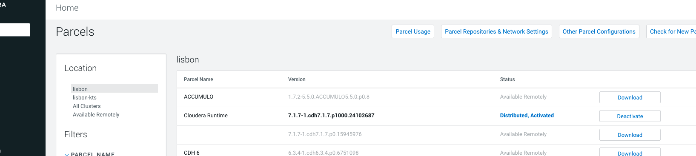


Add this public repository to Cloudera Manager: [https://datagen-repo.s3.eu-west-3.amazonaws.com/parcels/0.3.0/7.1.7.1000](https://datagen-repo.s3.eu-west-3.amazonaws.com/parcels/0.3.0/7.1.7.1000)


Save & Verify to make sure URL is correct, you should have:

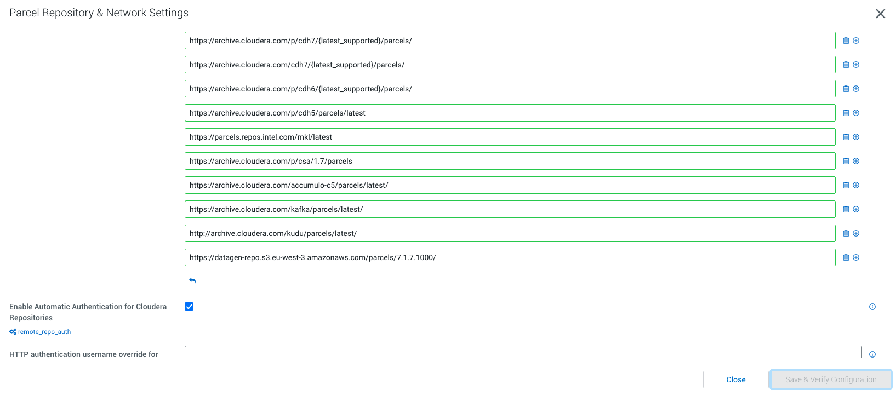


It is now possible to download Datagen parcel:

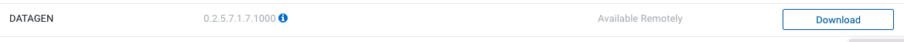


Then distribute it:

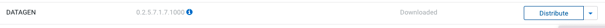


And finally activate it:

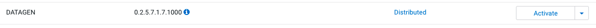


At the end, result should be:

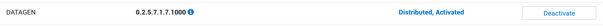


## Add Service wizard

Go Home in Cloudera Manager and pick the cluster where you want to install Datagen.

Click on _Actions > Add a Service_.

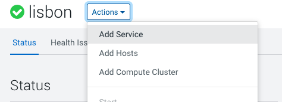


Now, it is possible to add Datagen as a Service to CDP:

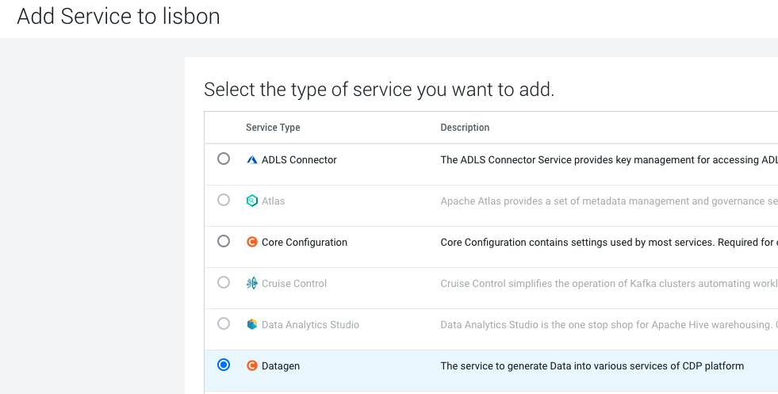


Start the Add Wizard by clicking on _Continue_.

Select where to places Datagen servers (best is to start with only one and scale up later if needed):

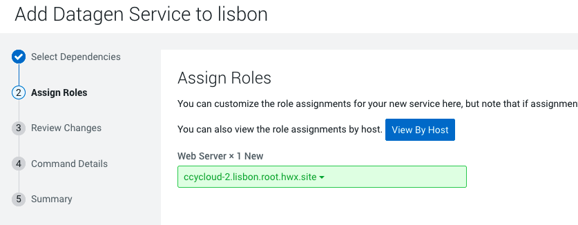

Review changes, they all should be filled in automatically, however it is recommended to set properly the ranger properties (they could be removed later):

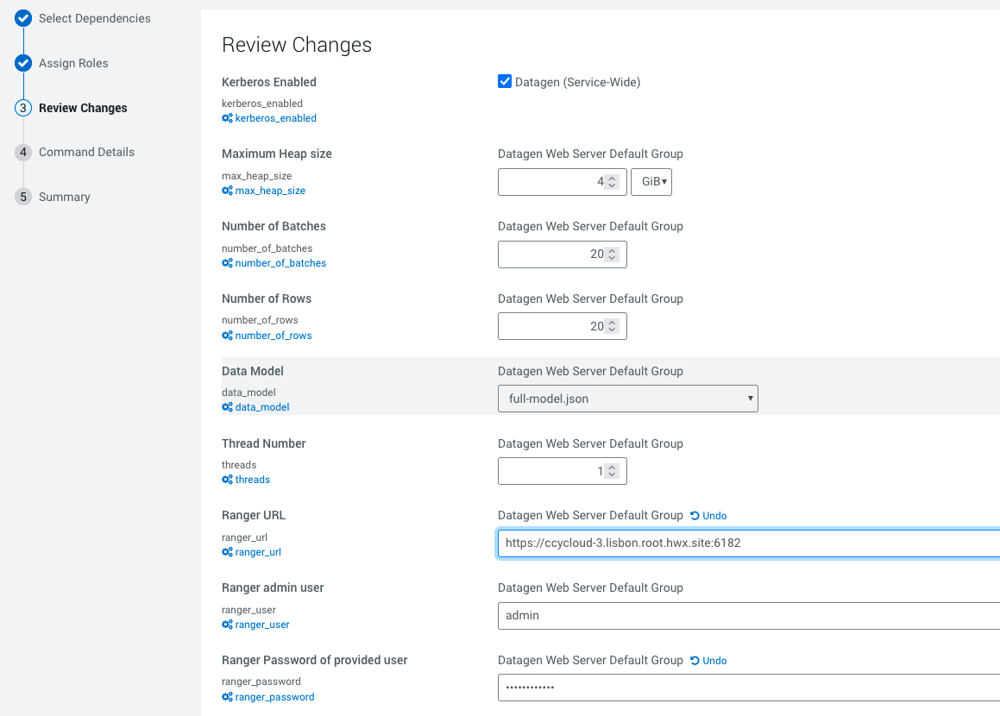


You should end up with:

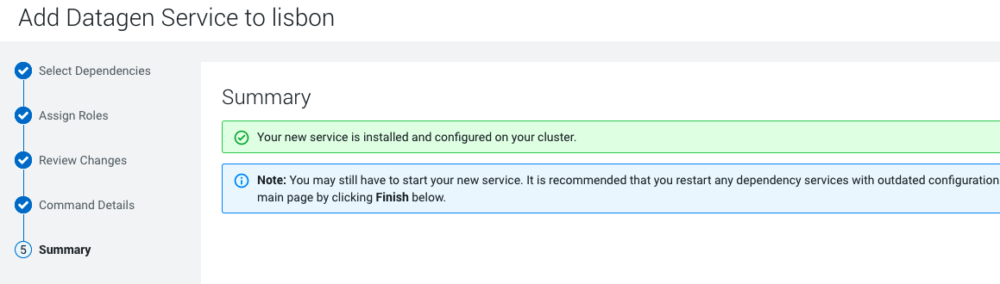


Restart CMS before going on: _Clusters > Cloudera Management Service_ , then _Actions > Restart_.


## Init Service

Before generating data, few steps are required to initialize the service.

Go to Datagen service and in _Actions_ : 

* Choose Datagen home directory locally  

    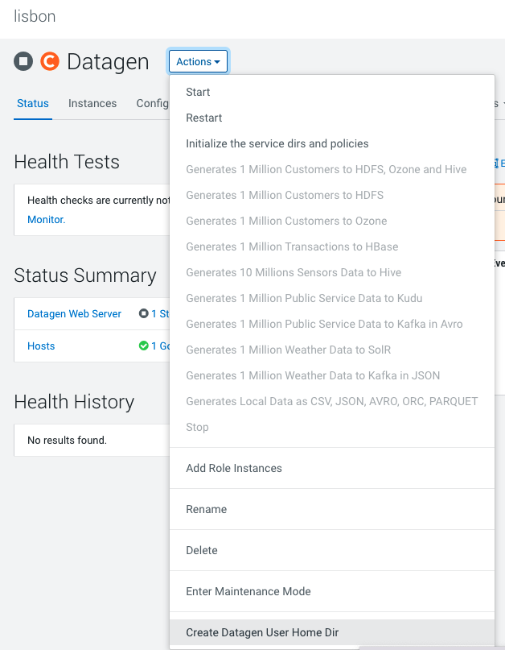

* Choose Initialize service dirs and policies

    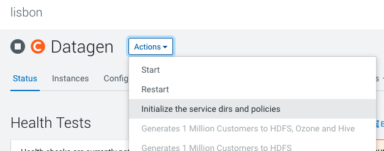


    This last step used the previous Ranger settings URL, user/password to push policies required by datagen to Ranger.

    You can safely remove these settings after this command is successful.  


* Eventually, you can restart Cloudera Management Service, so they can start to monitor Datagen service.


## Start Service

In _Actions > Start_.

Once command pop up launched, you can browse _Role Log_ and click on _Full Log File_: 

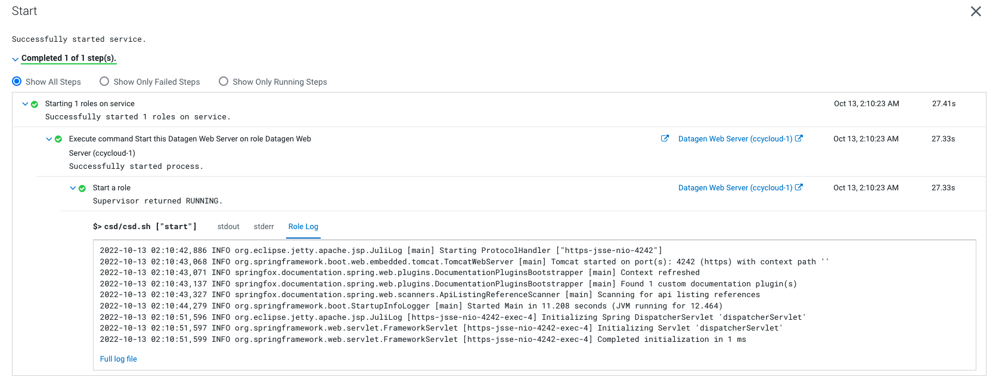


and verify it started well, you should have:

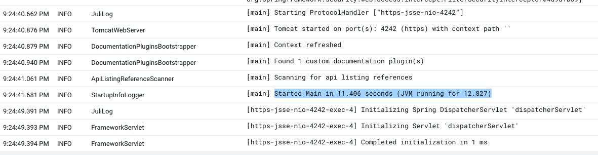


You can proceed to [Data Generation Basic Part](3-data-generation-basic.md)
