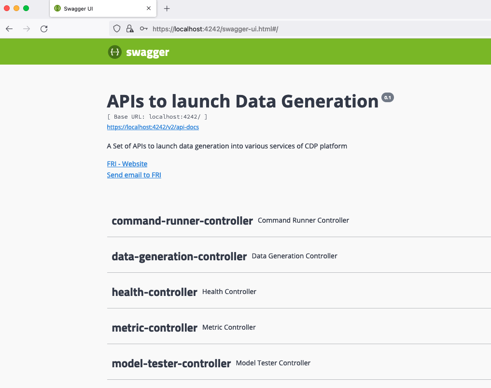
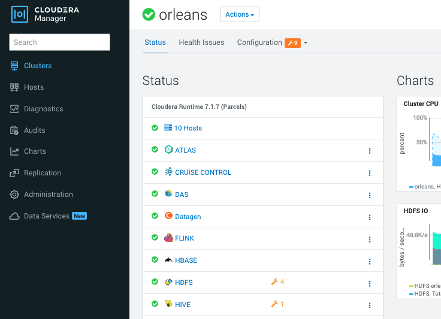

# Installation from source code

It is possible also for development, test purposes to create and deploy the Datagen service from the code.

## Setup the project

First, clone the Git project located here: [https://github.com/frischHWC/datagen(https://github.com/frischHWC/datagen) 

Then create your own branch: 

```shell
git clone https://github.com/frischHWC/datagen
cd datagen
git checkout -b my-branch
```

You can then develop, change the code, the configuration etc... and deploy this local version to any cluster.

You must just push your changes to your git branch.

It is advises that you have your own git repository be either doing a fork directly on github or adding an internal repository.


## Run locally

Before pushing the new code to Cloudera Manager, you can run and test locally.

You can either: 

* Import the project to your favorite IDE and run it from their, (IntelliJ comes with a start command for spring boot java project)
* Run it using command line with: `java -Dnashorn.args=--no-deprecation-warning --add-opens java.base/jdk.internal.ref=ALL-UNNAMED -jar target/DATAGEN*.jar` 

You can then access the Swagger UI on: https://localhost:4242/swagger-ui.html 



All configurations are taken from _application.properties_ file under _src/main/resources/_.

You can specify another properties file by adding this in your command line:

`--spring.config.location=file:/tmp/myconfig-file.properties`


## Run Installer tools

Go to directory: dev-support/deployment/ 

Inside there are all needed utilities to create the CSD, the parcel, and deploy it to a running CDP platform.

Main entry point is the script : `deploy.sh` that you should use.

Run `deploy.sh -h` to print the utility helper of the script like below:


```shell
******************************************
     Deployment of DATAGEN Started
******************************************
This script launches full deployment of Datagen on a running CDP Cluster

Usage is the following :

./deploy.sh
  -h --help

  --cluster-name= The name of the cluster to interact with (Default)
  --edge-host= : To create data generation from this node and install the service on it (Default)
  --ssh-user=root : To connect to clusters' host (Default) root
  --ssh-key= : To connect to clusters' host or provide a password (Default)
  --ssh-password= : To connect to clusters' host or provide a ssh-key (Default)

  --cm-host= : Cloudera Manger Host  (Default)
  --cm-port=7183 : Cloudera Manger Host  (Default) 7183
  --cm-protocol=https : Cloudera Manger Host  (Default) https
  --cm-user=admin : Cloudera Manger User (Default) admin
  --cm-password=admin : Cloudera Manger Password (associated to the above user) (Default) admin

  --ranger-password=admin : Ranger Password (associated to the admin user) (Default) admin

  --cdp-version=7.1.7.1000 : Version of CDP on which Datagen is deployed (Default) 7.1.7.1000
  --datagen-version=0.1.5 : Version of Datagen that will be set for this deployment  (Default) 0.1.5
  --distro-suffix=el7 : Version of OS to deploy datagen  (Default) el7

  --cluster-name-streaming= The name of the streaming cluster to interact with (that contains Kafka) (Default)

  --debug=false : To set DEBUG log-level (Default) false
  --log-dir=/tmp/datagen-deploy-logs/10-13-2022-13-33-00 : Log directory (Default) /tmp/datagen-deploy-logs/10-13-2022-13-33-00
  --launch-generation=false : To launch API calls to generate data after installation (Default) false

  --target-dir=/tmp/datagen : Target directory on edge machine (Default) /tmp/datagen

  --data-gen-git-url=https://github.com/frischHWC/datagen : Datagen Git URL to use (if different of official one) (Default) https://github.com/frischHWC/datagen
  --data-gen-git-branch=main : Datagen Git Branch to use (if different of official one) (Default) main

  --create-datagen=true : To launch playbooks for creation of datagen (Default) true
  --install-datagen=true : To launch playbooks for installation of datagen (Default) true
  --launch-datagen=true : To launch playbooks for launch of datagen (Default) true
```

Once you have required parameters, you can launch a full end to end build, deploy and run like this:


```shell
./deploy.sh \
    --cluster-name="my_cluster1" \
    --cm-host="my.host.example.com" \
    --edge-host="my.host.example.com" \
    --ranger-password="password" \
    --data-gen-git-branch="my-branch" \
    --data-gen-git-url="your.git.url.com" \
    --datagen-version="0.3.0"
```

## Check installation worked

Output of the scripts whould be like this:


```shell
******************************************
     Deployment of DATAGEN Started
******************************************
################### Creation of Datagen ###################
 SUCCESS: Datagen Creation made
################### Installation of Datagen ###################
 SUCCESS: Datagen Installation made
################### Launch of Datagen ###################
 SUCCESS: Launch of Datagen made
******************************************
     Deployment of DATAGEN Finished
******************************************
```

Set to debug with `--debug=true` if you want more details.

In case of error, it should output you the log file where to look for the error, but some may not be catched, so make sure installation worked by looking at teh cluster directly.

You should end with your service up and running like this:




You can proceed to [Data Generation Basic Part](3-data-generation-basic.md)